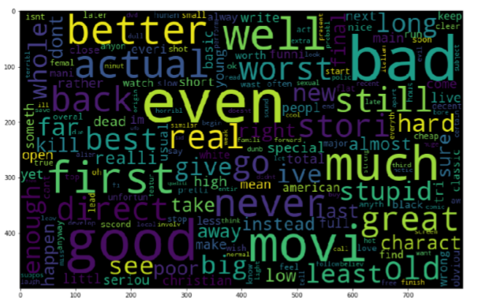
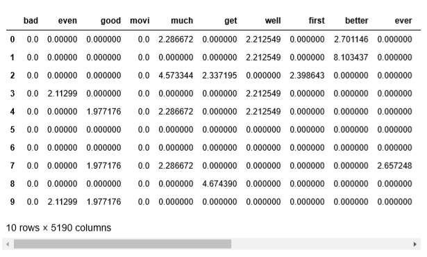
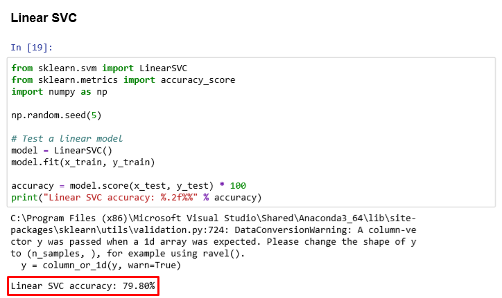

# Sentimental Analysis IMDb

> That it's my first algorithm of sentimental analysis based in NLP.

Used in this project:
* Numpy
* NLTK
* SciKit-Learn
* WordCloud

### The premises of the Natural Language Processing (NLP) consists in 3 steps:
1. **Preprocessing**
2. **(Feature) Extrating**
3. **Modeling**

## 1. Preprocessing
This step it's so important to get text and manipulate than in such a way improve our dataset of words.

Preprocessing consists in:
1. **Clean the input**
    - Try to obtain the words cleaning the inputs like removing HTML tag from a website
2. **Normalize**
    - Convert all caracters to same case, remove pontuation e etc.
3. **Tokenize**
    - Split the word according with the whitespaces.
4. **Remove the stop words**
    - Words witch don't give some meaning for the problem, usually conjuction, prepositions e etc.
5. **Stemming or Leammatization**
    - These thecnics are used to combine the derivatives of the words.
6. **Filtering by tags**
    - Tags are the sintaxe function of each word.

At final it's possible generate the `Bag of Words`, it's the dictionary of the mainly words

`Word Cloud` Way to plot the words by the frequency:

## 2. Feature Extrating
This step it's used to extract scalar values from texts witch are categorical values.

For that we get the inverse of the occurances using `TF-IDF` algorithm:
`tf-idf(t, d) = td(t, d) * log(N/(df+1))`

## 3. Modeling
This step it's impotant to predict values since of the algorithm has been learned with the TF-IDF input.

In this case i used the Linear SVC:
